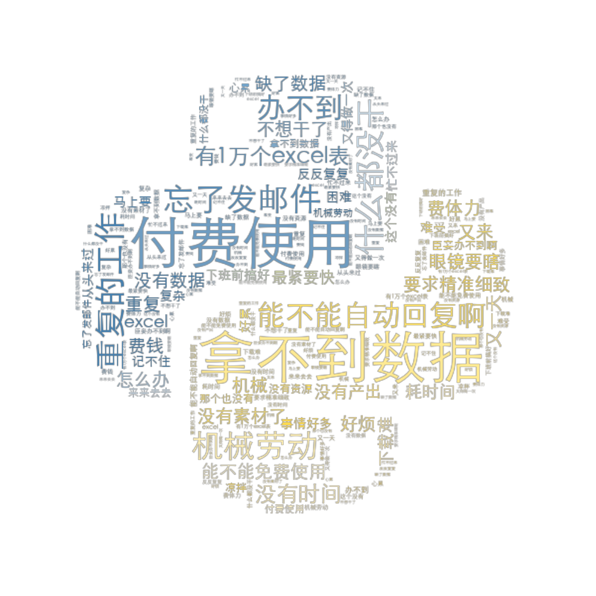

# py_application
将python应用到办公场景的简单示例代码。

Tutorial code for how to apply python into your daily work.

## Case 0. 基础语法 Fundamentals 
_[p10_start_to_learn.py](./p10_start_to_learn.py)_

介绍了python的基础语法。

The basic syntax of python.

## Case 1. 数据处理 Data Processing 
_[p21_work_with_pandas.py](./p21_work_with_pandas.py)_

利用pandas库进行数据读写和数据处理进行简介。

Use pandas to read and write. Learn to do data processing with python.

## Case 2. 发送邮件 Sending Email 
_[p22_send_email.py](./p22_send_email.py)_

通过smtplib配置进行邮件发送。

Use python to send email.

## Case 3. 文字云生成 Words to Picture 
_[p23_work_to_art.py](./p23_words_to_art.py)_

将文字转化为文字云样式的图片。

Group the words into some shape.

 

## Case 4. 从网站爬取图片 Get GIFs from Website 
_[p31_get_qdaily.py](./p31_get_qdaily.py)_

从好奇心日报网站上自动下载GIF图片。

Download GIFs from qdaily website.

## Case 5. 从携程爬取航班数据 Get Flight data from Ctrip 
_[p32_get_ctrip.py](./p32_get_ctrip.py)_

从携程网站上请求并获取数据。

Request and receive flight data from ctrip.
